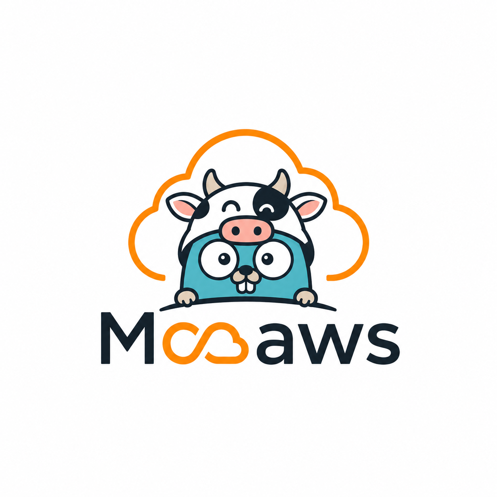

# MooAWS



MooAWS is an AWS enumeration and visualization tool that maps IAM identities, policies, EC2 instances, Security Groups, and S3 buckets into a graph database for easier analysis of permissions and attack paths.

## Features

* IAM Users, Groups, Roles, and Policies
* EC2 Instances and Security Groups
* S3 Bucket Enumeration
* Neo4j Graph Backend
* Interactive Web Dashboard
* Search and Relationship Visualization
* JSON Export Support

## Installation

```bash
pip install -r requirements.txt
```

Configure AWS credentials:

```bash
aws configure
```

Run the collector:

```bash
python3 main.py --default
```

## Start the API

```bash
cd api
go run main.go
```

Open:

```text
http://localhost:8080
```

## Tech Stack

* Python (Boto3)
* Go
* Neo4j
* HTML/CSS/JavaScript

## Disclaimer

Use only against AWS environments you own or are authorized to assess.
